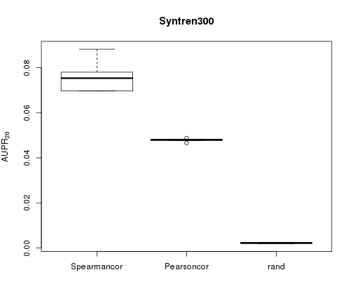
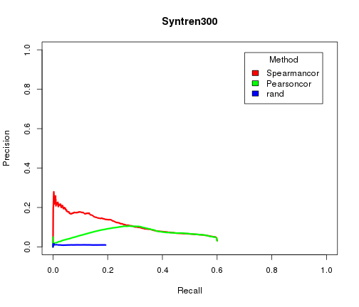
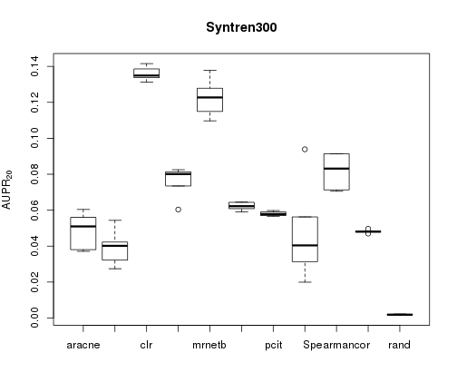

In the last decade, several methods have tackled the challenge of 
reconstructing gene regulatory networks from gene expression data. 
Several papers have compared and evaluated the different network inference 
methods relying on simulated data.

This is a new comparison that assesses different methods in a 
high-heterogeneity data scenario which could reveal the specialization 
of methods for the different network types and data.

This package allows repeating the comparison between different network
inference algorithms with only one line of code.

This package allows replication this comparison between the different 
networks inference algorithms with only one line of code. 

Toy example for main benchmark:

```r
    library(netbenchmark)
```

```
## Loading required package: grndata
```

```r
    top20.aupr <- netbenchmark(methods="all",datasources.names = "Toy",
                               local.noise=20,global.noise=10,
                               noiseType=c("normal","lognormal"),
                               datasets.num = 2,experiments = 40,
                               seed=1422976420,verbose=FALSE)
```

```
## Warning in netbenchmark(methods = "all", datasources.names = "Toy", local.noise = 20, : The specified number of experiments and 
##                     datasets is bigger than the orginal number of experiments 
##                     in the datasource: toy, 
##                     sampling with replacement will be used
```

```
## Estimate (local) false discovery rates (partial correlations):
## Estimate (local) false discovery rates (partial correlations):
```
The first element of the returned list is the $AUPR_{20}$:

```r
   print(top20.aupr[[1]])
```

```
##   Origin experiments aracne.wrap c3net.wrap  clr.wrap GeneNet.wrap
## 1    toy          48  0.14858187 0.13085487 0.1714301   0.05583115
## 2    toy          35  0.09280824 0.09350897 0.1172456   0.05237004
##   Genie3.wrap mrnet.wrap mutrank.wrap mrnetb.wrap pcit.wrap zscore.wrap
## 1   0.1786821  0.1701856   0.11900207   0.1760170 0.1696715  0.03307668
## 2   0.1425070  0.1197440   0.07485347   0.1216965 0.1418993  0.01477506
##         rand
## 1 0.02203073
## 2 0.02326192
```

The package provides an easy way to compare new techniques with  
state-of-the-art ones and to make new different benchmarks in the future.

First, define the wrapper functions:

```r
    Spearmancor <- function(data){
        cor(data,method="spearman")
    }

    Pearsoncor <- function(data){
        cor(data,method="pearson")
   }
```

Note that the wrapper function returns a matrix which is the weighted 
adjacency matrix of the network inferred by the algorithm and that the
columns and rows are named.

Evaluate five times these two simple inference methods with syntren300 
datasource:

```r
    res <- netbenchmark(datasources.names="syntren300",
        methods=c("Spearmancor","Pearsoncor"),verbose=FALSE)
    aupr <- res[[1]][,-(1:2)]
```
Make a boxplot of the $AUPR_{20}$ results:

```r
    boxplot(aupr, main="Syntren300",ylab=expression('AUPR'[20]))
```

 

Plot the mean Precision-Recall curves:

```r
    PR <- res[[5]][[1]]
    col <- rainbow(3)
    plot(PR$rec[,1],PR$pre[,1],type="l",lwd=3,col=col[1],xlab="Recall",
        ylab="Precision",main="Syntren300",xlim=c(0,1),ylim=c(0,1))
    lines(PR$rec[,2],PR$pre[,2],type="l",lwd=3,col=col[2])
    lines(PR$rec[,3],PR$pre[,3],type="l",lwd=3,col=col[3])
    legend("topright", inset=.05,title="Method",colnames(PR$rec),fill=col)
```

 

We can also compare these two simple inference methods with the fast network 
inference algorithms using syntren300 datasource:

```r
    comp <- netbenchmark(datasources.names="syntren300",
        methods=c("all.fast","Spearmancor","Pearsoncor"),verbose=FALSE)
```

```
## Estimate (local) false discovery rates (partial correlations):
## Estimate (local) false discovery rates (partial correlations):
## Estimate (local) false discovery rates (partial correlations):
## Estimate (local) false discovery rates (partial correlations):
## Estimate (local) false discovery rates (partial correlations):
```

```r
    aupr <- comp[[1]][,-(1:2)]
```

Make a boxplot the $AUPR_{20}$ results:

```r
    #make the name look prety
    library("tools")
    colnames(aupr) <- sapply(colnames(aupr),file_path_sans_ext)
    boxplot(aupr, main="Syntren300", ylab=expression('AUPR'[20]))
```

 
